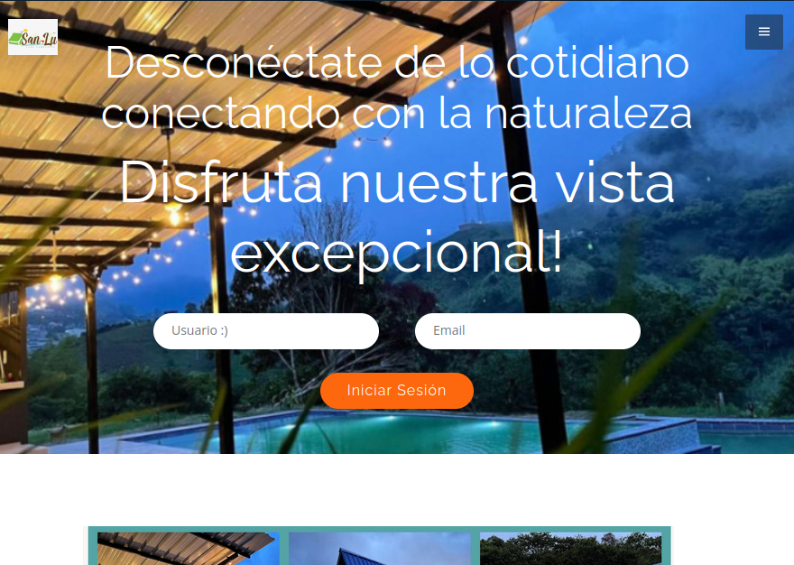

# Landing page front using bootstrapmade

In this project, I used Bootstrapmade to generate the landing page of a website for cabin rentals.

[Click here for the preview](https://drt-dave.github.io/ciclo3front/)

 

>    Click on the image to visit the site 👆 
